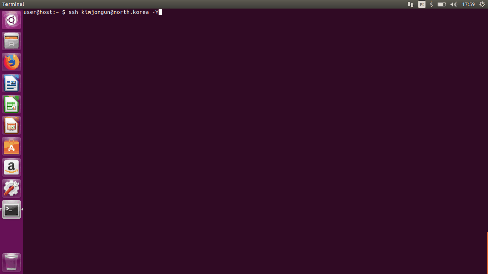

# What?

Visual Basic GUI (VBG for short) uses a X11 forwarded SSH session to remotely execute commands on the client.

# Motivation

On its usual mode of operation SSH requires the client to be trusted by the server, however with X11
it's also necessary that the client trust the server, given that X exposes a lot of features that
allow the remote server to open windows, intercept keystrokes, etc. Despite being well known to be
dangerous, most people don't expect to have their machines compromised with a SSH connection.
Since I did not find another PoC using SSH forwarded sessions to execute commands, I made this.

# Demo



# How?

Trusted X11 forwarding (the -Y option) exposes a *lot* of X11 extensions to the server and it's
possible to do all sorts of nasty things, like enumerating open windows, recording/injecting
keyboard and mouse events, etc.
The tool uses `wmctrl` to detect the client's windows manager and uses the XTEST extension to inject
keystrokes and deliver a payload specific to their environment. It works exactly like it would if
running locally, I've only added a `ForceCommand` option inside `sshd_config` to run the script and
exit. It can also read and execute payloads similar to the ones used by Rubber Ducky.

# Project Organization

`write_cmd.c` does the typing via sending keyboard events.

`vbg.py` is a `python` script responsible for most of the logic, it is responsible for the window
manager detection, parsing the payloads and calling the `write_cmd` binary.

# Installation

```
wget https://raw.githubusercontent.com/xfee/vbg/master/setup.sh
chmod +x ./setup.sh
sudo ./setup.sh $username
```

The setup script will download dependencies, create a new user and configure the SSH daemon to
simulate the keystrokes automatically.

# Usage
## Client

Simply specify `-Y` when connecting and login like usual:
`ssh -Y $username@$server_ip`

## Server
It's also possible to manually run the script after logging in:

### With automatic WM detection and payload selection:
```
cd /opt/vbg && ./vbg.py -m cmd
```

### With manual payload selection:
```
cd /opt/vbg && ./vbg.py -m cmd -p payloads/i3_payload
```

# Known Issues

* Since characters that can only be typed while pressing a modifier key (such as uppercase letters, dollar
sign, etc) cannot be mapped directly from keycodes to inject a `$` you have to send `SHIFT-4`.
Detecting and properly handling these characters seems too much work for a PoC, so don't use them.
* Payloads are not 100% compatible with the RubberDucky and some instructions are not implemented.
* Keyboard layout shenanigans apply.
* macOS is not vulnerable, even with XQuartz installed (it doesn't expose the XTEST extensions).
* Most recent distro releases are probably not going to work because Wayland seems to be default now.

# Related Projects

https://github.com/CoolerVoid/rootstealer

